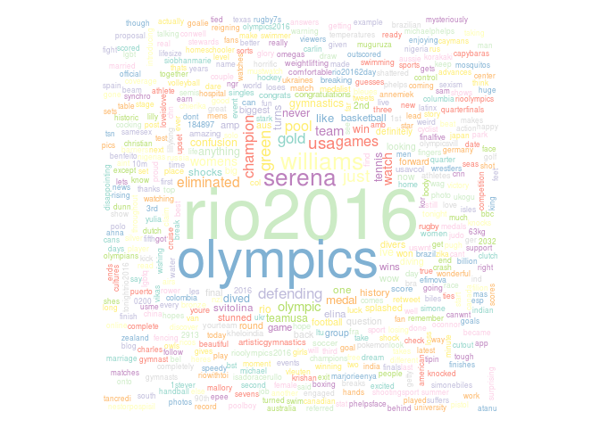

tweet-sentiment-analysis
================

This project is a demonstration of how to use R to download tweets from [Twitter](http://twitter.com) and perform a sentiment analysis in their textual data, in order to get an overall grasp of the opinions of people around the world about some topic of interest.

Users of these scripts can choose the key terms to search, the date span, the target language (English or Portuguese) and the maximum number of tweets to download. The analysis then includes:

-   Polarity classification (how many tweets are saying positive or negative things about the topic?)
-   Emotion classification (how many tweets are expressing joy, sadness, angriness, and other emotions?) *OBS: only available for the English language*
-   Wordcloud and dendrogram generation (what words are most frequently associated to the search terms?)

Classifications are based on algorithms that analyze the proportions of positive and negative words each tweet has. The [Subjectivity](http://mpqa.cs.pitt.edu/lexicons/subj_lexicon/) and [SentiLex-PT02](http://dmir.inesc-id.pt/project/SentiLex-PT_02_in_English) lexicons are used to help to identify such words. Of course, a deep sentiment analysis can become much complex than that, since the meaning of a word can be altered by its context; however, this kind of analysis, although simple, can provide accurate results in many cases.

**Example**: let's say we want to know the feedback that people were giving about the Rio 2016 Olympics, on Twitter, during the first 5 days of the event. By running the *sentiment\_analysis.R* script and entering the right input, the following outputs are given:

As the results of the polarity analysis show, most English speaking users on Twitter were excited and giving positive feedback about the Rio 2016 Olympics. Moreover, the emotion classification tells us that, among those tweets whose predominant emotion could be identified, most are expressing joy.

The same polarity analysis can be done with tweets in Portuguese too, using the same scripts. And provided that proper lexicons are made available, even other languages could be supported in the future.
